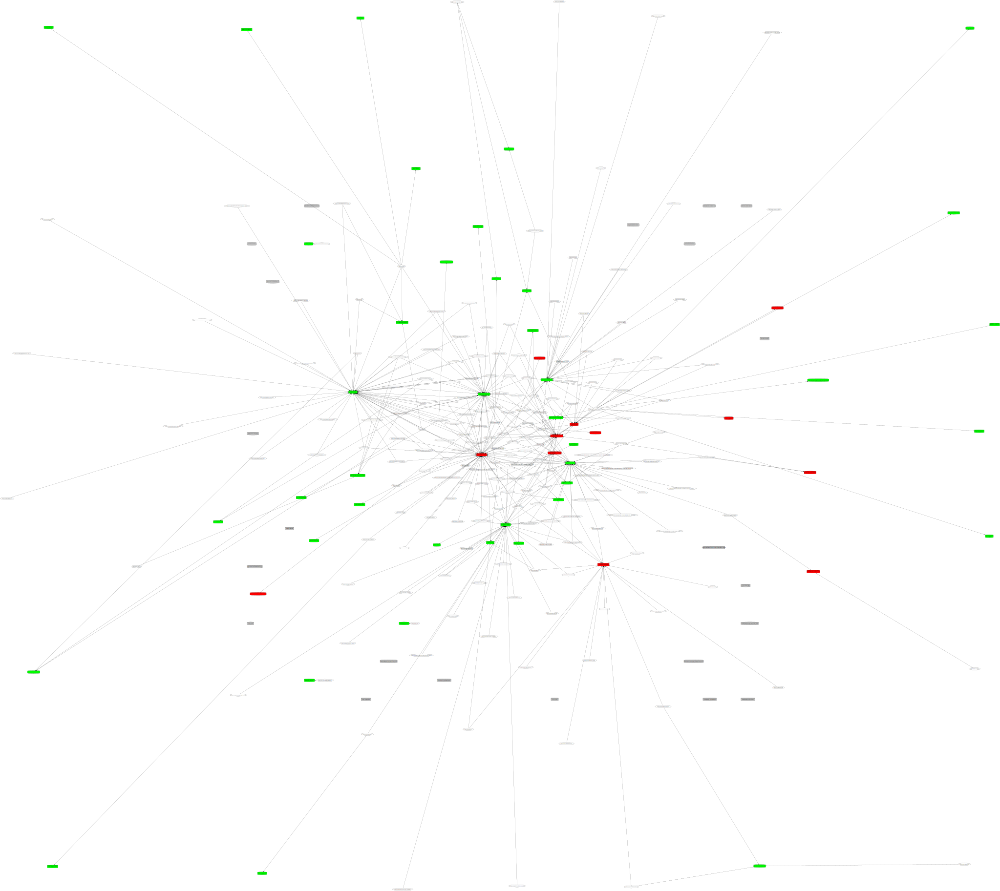

= Vizns

Visualize the relationship between namespaces and their dependencies.

== Usage

Add vizns as an alias in your ~/.clojure/deps.edn so it's available in any project:

[source,clojure]
----
{:aliases
 {:user/vizns
  {:deps {io.dominic/vizns {:git/url "https://github.com/SevereOverfl0w/vizns.git"
                            :sha "9ae062aca156ec59f7ceaafd55960abbd37b1ce5"}}
   :main-opts ["-m" "clojure.tools.deps.graph"]}}}
----

Run in your project

[source,bash]
.Produce a deps-graph.dot file
----
$ clj -A:user/vizns
----

TIP: You can upload the .dot file to https://edotor.net/ to view without having graphviz installed.

[source,bash]
.Produce a deps-graph image directly
----
$ clj -A:user/vizns -o deps-graph.png -f png
$ clj -A:user/vizns -o deps-graph.svg -f svg
----

[source,bash]
.View graph without saving
----
$ clj -A:user/vizns --show
----

=== Output information

Dependencies can be colored 3 colors:

Green:: You're doing the right thing, carry on.
Red:: You're using this dependency, but you're relying on it being brought in transitively.  This means you're relying on an implementation detail of a library.  You should add this dependency to your deps.edn
Grey:: You're not using this dependency (NOTE: There's a lot of false positives here, especially around java)

== Example

(Example sourced from link:https://gitlab.com/camelot-project/camelot[camelot])

